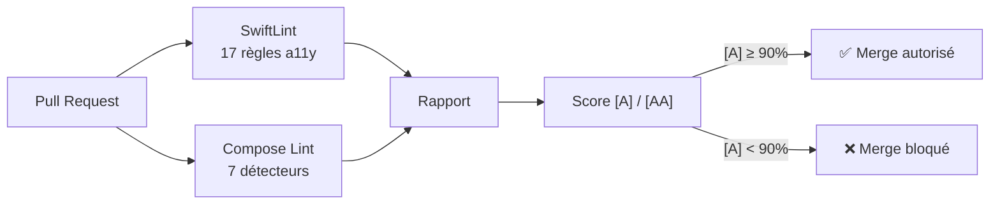

---
tags:
  - guides
  - ci
---

# Intégration CI/CD

FRAM fournit des workflows GitHub Actions prêts à l'emploi pour bloquer les PRs contenant des violations d'accessibilité critiques.

## Architecture



---

## GitHub Actions — iOS

Copier le fichier dans `.github/workflows/` :

```bash
cp mobile-ally-framework/linting/ci/a11y-lint-ios.yml .github/workflows/
```

!!! info "Comportement"
    - Se déclenche sur les PRs modifiant des fichiers `.swift`
    - Exécute SwiftLint avec les 17 règles FRAM
    - **Bloque la PR** si des violations de sévérité `Error` (niveau [A]) sont détectées
    - Publie un résumé dans le **PR Summary**
    - Archive le rapport JSON en artifact (30 jours)

---

## GitHub Actions — Android

```bash
cp mobile-ally-framework/linting/ci/a11y-lint-android.yml .github/workflows/
```

!!! info "Comportement"
    - Se déclenche sur les PRs modifiant des fichiers `.kt` / `.kts`
    - Exécute `./gradlew lint` incluant les 7 détecteurs FRAM
    - Extrait les issues FRAM du rapport XML
    - **Bloque la PR** si des violations `Error` sont trouvées
    - Archive le rapport Lint (XML + HTML)

---

## Rapport de conformité

Le script `a11y-report.sh` génère un rapport combiné JSON + HTML :

```bash
# Générer après les deux lints
./linting/ci/a11y-report.sh \
    --ios swiftlint-report.json \
    --android app/build/reports/lint-results-debug.xml \
    -o ./rapport-a11y/
```

Sortie :

| Fichier | Format | Contenu |
|---|---|---|
| `a11y-report.json` | JSON | Scores machine-readable, nombre de violations par niveau |
| `a11y-report.html` | HTML | Dashboard visuel avec barres de progression et tableau des règles |

---

## Seuils recommandés

| Environnement | Score [A] minimum | Score [AA] minimum | Action si sous le seuil |
|---|---|---|---|
| **PR** | 100% (0 error) | — | Bloquer le merge |
| **Nightly** | ≥ 90% | ≥ 70% | Notification Slack |
| **Release** | 100% | ≥ 85% | Bloquer le déploiement |

!!! warning "Règle d'or"
    **Aucune violation de niveau [A] ne doit être fusionnée.** Ces violations rendent l'application inaccessible aux utilisateurs de lecteurs d'écran.
