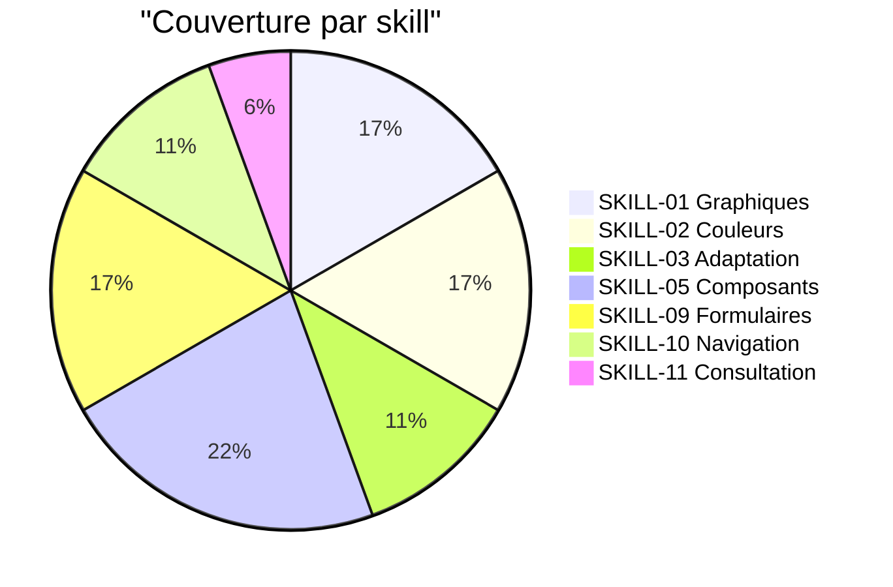

---
tags:
  - linting
  - index
---

# Linting statique

Le linting statique FRAM détecte automatiquement les violations d'accessibilité **au moment de l'écriture du code**, avant même de compiler.

## Couverture

!!! note "Limitations"
    Le linting statique couvre environ **40% des violations de niveau [A]** détectables statiquement. Il ne remplace pas un audit VoiceOver/TalkBack manuel.

---

## Plateformes

-   :material-apple:{ .lg .middle } __SwiftLint (iOS)__

    ---

    **17 règles custom** basées sur les regex SwiftLint.
    Intégration Xcode Build Phase.

    [:octicons-arrow-right-24: Configuration SwiftLint](swiftlint.md)

-   :material-android:{ .lg .middle } __Compose Lint (Android)__

    ---

    **7 détecteurs UAST** analysant l'arbre syntaxique Kotlin.
    Module Gradle à inclure.

    [:octicons-arrow-right-24: Configuration Compose Lint](compose-lint.md)

---

## Sévérité

| Sévérité | Niveau RAAM | Comportement |
|---|---|---|
| :material-alert-circle:{ .text-red } **Error** | `[A]` | Bloque la compilation / la CI |
| :material-alert:{ .text-yellow } **Warning** | `[A]` ou `[AA]` | Signal à investiguer |

---

## Catalogue complet

[:octicons-arrow-right-24: Voir les 25 règles](catalogue-regles.md)
