---
tags:
  - skills
  - index
---

# Skills — Vue d'ensemble

Les 12 skills FRAM couvrent l'intégralité du [référentiel RAAM 1.1](https://accessibilite.public.lu/fr/raam1.1/referentiel-technique.html). Chaque skill fournit :

- 📖 **Documentation** — Critères, bonnes pratiques, pièges courants
- 📱 **Patterns SwiftUI** — Code prêt à copier avec ✅/❌
- 🤖 **Patterns Compose** — Code Material3 prêt à copier
- 🧪 **Tests automatisés** — XCUITest + Compose UI Test

---

## Cartographie

```mermaid
graph LR
    subgraph "Présentation"
        S01["🖼️ 01 — Graphiques"]
        S02["🎨 02 — Couleurs"]
        S03["📐 03 — Adaptation"]
    end
    subgraph "Structure"
        S04["📊 04 — Tableaux"]
        S06["🌐 06 — Langue"]
        S07["📑 07 — Structuration"]
    end
    subgraph "Interaction"
        S05["🔘 05 — Composants"]
        S09["📝 09 — Formulaires"]
        S10["🧭 10 — Navigation"]
    end
    subgraph "Contenu"
        S08["⏱️ 08 — Temporels"]
        S11["👆 11 — Consultation"]
        S12["📚 12 — Documentation"]
    end

    style S01 fill:#1a1f25,stroke:#58a6ff
    style S02 fill:#1a1f25,stroke:#58a6ff
    style S03 fill:#1a1f25,stroke:#58a6ff
    style S04 fill:#1a1f25,stroke:#3fb950
    style S05 fill:#1a1f25,stroke:#d29922
    style S06 fill:#1a1f25,stroke:#3fb950
    style S07 fill:#1a1f25,stroke:#3fb950
    style S08 fill:#1a1f25,stroke:#bc8cff
    style S09 fill:#1a1f25,stroke:#d29922
    style S10 fill:#1a1f25,stroke:#d29922
    style S11 fill:#1a1f25,stroke:#bc8cff
    style S12 fill:#1a1f25,stroke:#bc8cff
```

---

## Par niveau de conformité

### :material-shield-check: Audit simplifié `[A]`

| Skill | Critères [A] | Thématique |
|---|---|---|
| [SKILL-01](skill-01.md) | 7 | Images, icônes, CAPTCHA, descriptions détaillées |
| [SKILL-02](skill-02.md) | 1 | Information non véhiculée par la couleur seule |
| [SKILL-03](skill-03.md) | 1 | Info non véhiculée par forme/taille/position seule |
| [SKILL-04](skill-04.md) | 3 | Tableaux avec en-têtes, cellules associées |
| [SKILL-05](skill-05.md) | 5 | Nom, rôle, état des composants interactifs |
| [SKILL-06](skill-06.md) | 4 | Langue déclarée, titres d'écran |
| [SKILL-07](skill-07.md) | 2 | Listes structurées, citations |
| [SKILL-08](skill-08.md) | 6 | Sous-titres, autoplay contrôlable, Reduce Motion |
| [SKILL-09](skill-09.md) | 5 | Labels de champs, erreurs, champs obligatoires |
| [SKILL-10](skill-10.md) | 3 | Titre d'écran, ordre de focus, raccourcis |
| [SKILL-11](skill-11.md) | 3 | Timeouts, contenus en mouvement, clignotement |
| [SKILL-12](skill-12.md) | 2 | Documentation accessible, fonctionnalités documentées |

### :material-shield-star: Audit complet `[AA]`

| Skill | Critères [AA] | Thématique |
|---|---|---|
| [SKILL-01](skill-01.md) | 2 | Images texte, images légendées |
| [SKILL-02](skill-02.md) | 8 | Ratios de contraste 4.5:1 / 3:1, dark mode |
| [SKILL-03](skill-03.md) | 5 | Dynamic Type, orientation, Reflow |
| [SKILL-04](skill-04.md) | 1 | Description du tableau |
| [SKILL-05](skill-05.md) | 1 | Actions custom (swipe-to-delete) |
| [SKILL-07](skill-07.md) | 2 | Hiérarchie des titres cohérente |
| [SKILL-08](skill-08.md) | 3 | Audiodescription, sous-titres live |
| [SKILL-09](skill-09.md) | 1 | Saisie automatique (textContentType) |
| [SKILL-10](skill-10.md) | 3 | Cohérence navigation, focus visible, focus non piégé |
| [SKILL-11](skill-11.md) | 3 | Zones de touche 44pt/48dp, erreurs récupérables |
| [SKILL-12](skill-12.md) | 2 | Support fonctionnalités système, conformité APIs |

---

!!! tip "Conseil"
    Commencez par les skills **SKILL-01**, **SKILL-05** et **SKILL-09** — ils couvrent les violations les plus fréquentes dans les audits.
